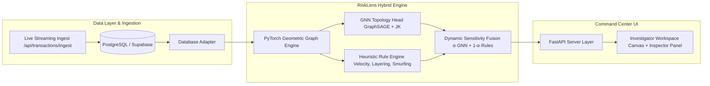

<<<<<<< HEAD
# 🔍 RiskLens — Enterprise Graph & Heuristic Fraud Intelligence

[](LICENSE)
[](https://www.python.org/)
[](https://fastapi.tiangolo.com)
[](https://pyg.org)
[](https://supabase.com)

**RiskLens** is a production-grade fraud and money-laundering (AML) risk-intelligence platform built for high-throughput financial transaction graphs. By combining deep multi-hop **Graph Neural Networks (GraphSAGE / GATv2)** with a deterministic **Heuristic Rule Engine**, RiskLens identifies coordinated mule rings, circular routing cycles, and rapid pass-through layering in real time.

---

## 🏛️ System Architecture



---

## 🚀 Key Differentiators & Features

1. **Hybrid Scoring Engine ($\alpha$-Tunable Sensitivity)**:
   - Evaluates risk as $S_{\text{composite}} = \alpha \cdot S_{\text{GNN}} + (1 - \alpha) \cdot S_{\text{Heuristic}}$.
   - Hackathon judges and compliance officers can adjust the sensitivity slider directly from the UI in real time to shift weight between algorithmic graph patterns and explicit banking rule triggers.
2. **Relational Database Adapter (Supabase / PostgreSQL)**:
   - Replaces static file-bound datasets with a live relational schema (`accounts`, `transactions`, `fraud_cases`, and `risk_assessments`).
   - Dynamic schema generation with SQLite fallback for seamless local demos.
3. **Investigator Command Center UI**:
   - High-contrast, human-crafted dark mode (`#09090b` obsidian background, `#27272a` zinc borders, amber `#f59e0b` warnings, and emerald `#10b981` safe indicators).
   - Monospace typography (`JetBrains Mono` / `Fira Code`) paired with clean `Inter` UI text for an authentic intelligence console.
   - Split-pane layout: Interactive radial ego-network canvas on the left, and a dense forensic inspector dossier on the right.
4. **Heuristic Rule Engine**:
   - **RULE-LAYER-01**: Pass-through mule layering (rapid inflow/outflow balance within 15% parity).
   - **RULE-VEL-02**: Fan-out burst velocity detection.
   - **RULE-NEIGHBOR-03**: Neighborhood infection / guilt-by-association clustering.
   - **RULE-STRUCT-04**: Smurfing / structuring under regulatory thresholds.
   - **RULE-GEO-05**: Impossible velocity geographic locale shifts.

---

## 💾 Relational Database Schema

```sql
-- Core Accounts
CREATE TABLE accounts (
    account_id VARCHAR(64) PRIMARY KEY,
    customer_name VARCHAR(128) NOT NULL,
    account_type VARCHAR(32) DEFAULT 'INDIVIDUAL',
    kyc_status VARCHAR(32) DEFAULT 'VERIFIED',
    initial_balance NUMERIC(14, 2) DEFAULT 0.00,
    created_at TIMESTAMP WITH TIME ZONE DEFAULT CURRENT_TIMESTAMP,
    country_code VARCHAR(8) DEFAULT 'IN',
    is_seed_fraud BOOLEAN DEFAULT FALSE,
    ring_id INTEGER DEFAULT -1
);

-- Core Transactions
CREATE TABLE transactions (
    tx_id VARCHAR(64) PRIMARY KEY,
    src_account_id VARCHAR(64) REFERENCES accounts(account_id),
    dst_account_id VARCHAR(64) REFERENCES accounts(account_id),
    amount NUMERIC(14, 2) NOT NULL,
    currency VARCHAR(8) DEFAULT 'INR',
    timestamp TIMESTAMP WITH TIME ZONE DEFAULT CURRENT_TIMESTAMP,
    channel VARCHAR(32) DEFAULT 'UPI',
    geo_location VARCHAR(64),
    is_flagged_fraud BOOLEAN DEFAULT FALSE
);

-- Real-Time Risk Ledger
CREATE TABLE risk_assessments (
    assessment_id SERIAL PRIMARY KEY,
    account_id VARCHAR(64) REFERENCES accounts(account_id),
    assessed_at TIMESTAMP WITH TIME ZONE DEFAULT CURRENT_TIMESTAMP,
    composite_risk_score NUMERIC(5, 4) NOT NULL,
    gnn_score NUMERIC(5, 4) NOT NULL,
    heuristic_score NUMERIC(5, 4) NOT NULL,
    risk_band VARCHAR(16) NOT NULL,
    decision VARCHAR(32) NOT NULL,
    violations_json TEXT,
    sensitivity_alpha NUMERIC(4, 2) DEFAULT 0.65
);
```

---

## ⚡ Quickstart

### 1. Installation
```bash
pip install -e .
```

### 2. Environment Configuration (Optional)
To connect to a live Supabase or PostgreSQL instance, export:
```bash
export SUPABASE_DB_URL="postgresql://postgres:[PASSWORD]@[HOST]:5432/postgres"
```
*(If omitted, RiskLens defaults to local persistence via SQLite).*

### 3. Initialize Relational Schema
```bash
python -m risklens.cli init-db --models-dir models
```

### 4. Launch the Command Center
```bash
python -m risklens.cli serve --models-dir models --host 127.0.0.1 --port 8000
```
Open **[http://127.0.0.1:8000](http://127.0.0.1:8000)** in your browser.

---

## 📡 REST API Reference

| Endpoint | Method | Description |
|---|---|---|
| `/healthz` | `GET` | Health status, model metadata, and connected DB backend. |
| `/api/summary` | `GET` | High-level graph statistics, positive fraud ratios, and detected ring counts. |
| `/api/top?k=50` | `GET` | High-risk investigation queue sorted by hybrid composite score. |
| `/api/account/{id}` | `GET` | Complete inspector dossier, degree metrics, and triggered heuristic violations. |
| `/api/graph/subgraph/{id}` | `GET` | Topological sub-graph payload for network rendering with ring edge flags. |
| `/api/sensitivity` | `GET/POST`| Live dynamic adjustment of GNN weight $\alpha$ and threshold cutoffs. |
| `/api/transactions/ingest` | `POST` | Live ingestion of streaming transfers directly into relational storage. |
=======
# SnackOverFlow-MuleTrace
MuleTrace uses Graph Neural Networks to detect coordinated fraud rings in UPI payment networks. It ships a full pipeline—synthetic graph generation, GNN training, baseline comparison, and adversarial testing. A FastAPI dashboard and MCP server let analysts and AI agents investigate flagged accounts in real time.
>>>>>>> 1e3cf7d91fb84a860c7683acfcf9e35d629a07cf
